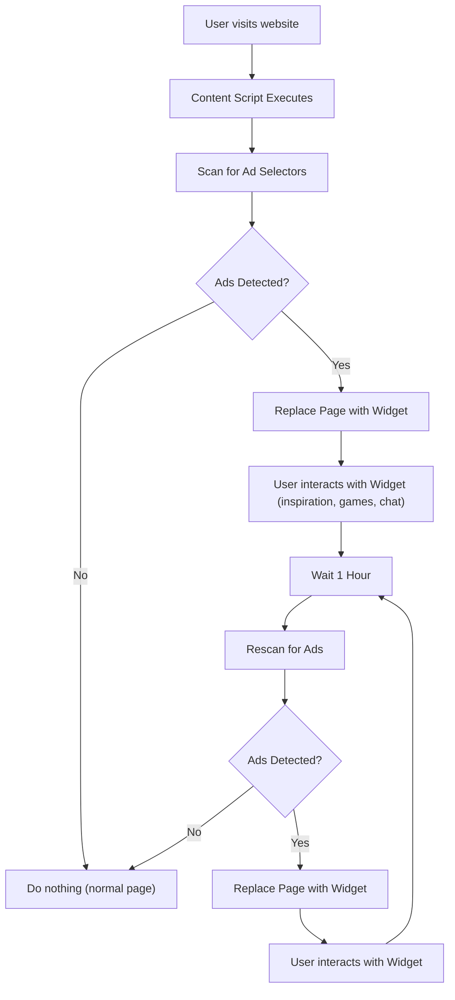

# Documentation: How to Start the AdFriend Chrome Extension

Here is the flow of the adFriend chrome extension:



To start the application, follow these steps:

1. **Clone the repo**: clone the repository from [github](https://github.com/Zaccodder/adFriend)

2. **Install Dependencies**: Ensure you have all the necessary dependencies installed. You can do this by running:

```sh
npm install
```

or

```sh
yarn install
```

3. **Go to open router**: Get your Api Key from [open router ai](https://openrouter.ai/) and provide it in the setting section of the app

4. **Build the project**: Using the command below build the extension

```
npm run build

```

5. **Go to your browser**: Go to [chrome browser](chrome://extensions/) click on the developer mode to ON it and then click on the load unpack to navigate to the directory where the project and select the dist...load it and then click on the extension of the app to load it.

6. After installing it the extension will monitor any incoming ads coming to any website you visited and it will be displayin nice motivational widget and also it has some other things to look in the pop window.

7. **Test it on this website**
   [Tpoint](https://www.tpointtech.com/data-structure-asymptotic-analysis)

Author: [Muhammad Bashir Ibrahim](https://github.com/Zaccodder)
