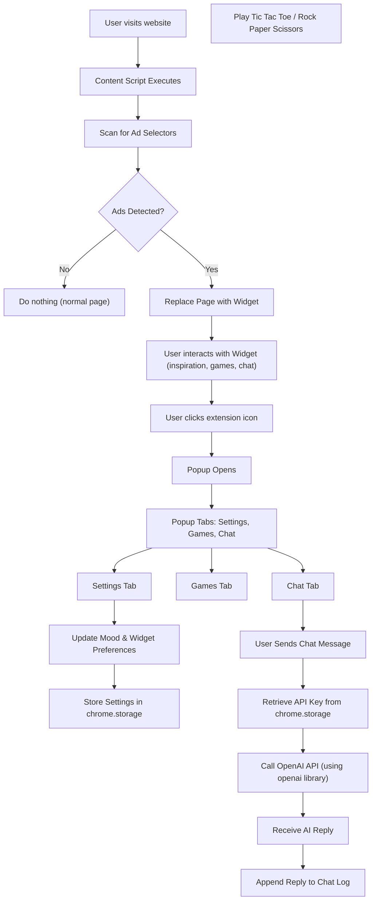

Here is the flow of the adFriend chrome extension:

```mermaid
flowchart TD;
A[User visits website]
B[Content Script Executes]
C[Scan for Ad Selectors]
D{Ads Detected?}
E["Do nothing (normal page)"]
F[Replace Page with Widget]
G["User interacts with Widget (inspiration, games, chat)"]
H[User clicks extension icon]
I[Popup Opens]
J["Popup Tabs: Settings, Games, Chat"]
K[Settings Tab]
L["Update Mood & Widget Preferences"]
M[Store Settings in chrome.storage]
N[Games Tab]
O[Play Tic Tac Toe / Rock Paper Scissors]
P[Chat Tab]
Q[User Sends Chat Message]
R[Retrieve API Key from chrome.storage]
S["Call OpenAI API (using openai library)"]
T[Receive AI Reply]
U[Append Reply to Chat Log]

    A --> B
    B --> C
    C --> D
    D -- No --> E
    D -- Yes --> F
    F --> G
    G --> H
    H --> I
    I --> J
    J --> K
    J --> N
    J --> P
    K --> L
    L --> M
    P --> Q
    Q --> R
    R --> S
    S --> T
    T --> U

```
